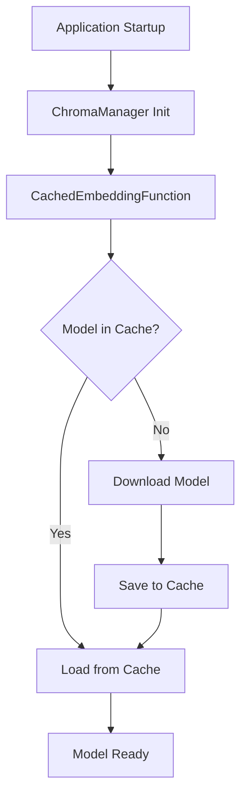

# Model Caching System

This document describes the model caching system implemented to avoid repeated downloads of embedding models.

## Overview

The embedding models used by the Abar chatbot are now cached locally to improve startup times and reduce bandwidth usage. Instead of downloading models every time the application starts, models are downloaded once and reused from the local cache.

## Models Used

### 1. Arabic Model (Main ChromaDB)
- **Model**: `mohamed2811/Muffakir_Embedding_V2`
- **Purpose**: Arabic language embedding for better Arabic text understanding
- **Size**: ~500MB (estimated)
- **Used by**: `vectorstore/chroma_db.py`

### 2. Lightweight Model (ChromaDB Lite)
- **Model**: `all-MiniLM-L6-v2`
- **Purpose**: Lightweight multilingual embedding model
- **Size**: ~90MB (estimated)
- **Used by**: `vectorstore/chroma_db_lite.py`

## Cache Location

Models are cached in the `models/cache/` directory:
```
project_root/
├── models/
│   └── cache/
│       ├── mohamed2811_Muffakir_Embedding_V2/
│       └── all-MiniLM-L6-v2/
```

## Usage

### Automatic Caching
Models are automatically cached when first used. The system will:
1. Check if the model exists in cache
2. If not cached, download and save the model
3. If cached, load from local storage

### Manual Cache Management

#### Pre-load Models
```bash
# Pre-download all models used by the application
python manage_model_cache.py preload
```

#### Check Cache Status
```bash
# Show information about cached models
python manage_model_cache.py info
```

#### Clear Cache
```bash
# Clear all cached models
python manage_model_cache.py clear

# Clear specific model
python manage_model_cache.py clear "mohamed2811/Muffakir_Embedding_V2"
```

#### Test Models
```bash
# Test all cached models
python manage_model_cache.py test
```

### API Endpoints

#### Get Cache Information
```http
GET /models/cache/info
```

Response:
```json
{
  "status": "success",
  "cache_info": {
    "cache_dir": "/path/to/models/cache",
    "model_count": 2,
    "total_size_mb": 590.5,
    "models": [
      {
        "name": "mohamed2811/Muffakir_Embedding_V2",
        "size_mb": 500.2,
        "path": "/path/to/cache/mohamed2811_Muffakir_Embedding_V2"
      },
      {
        "name": "all-MiniLM-L6-v2", 
        "size_mb": 90.3,
        "path": "/path/to/cache/all-MiniLM-L6-v2"
      }
    ]
  }
}
```

#### Pre-load Models
```http
POST /models/cache/preload
```

Response:
```json
{
  "status": "success",
  "message": "Model preloading completed",
  "results": [
    {"model": "mohamed2811/Muffakir_Embedding_V2", "status": "loaded", "cached": true},
    {"model": "all-MiniLM-L6-v2", "status": "loaded", "cached": true}
  ],
  "cache_info": { ... }
}
```

## Performance Benefits

### Before Caching
- **First startup**: 2-5 minutes (downloading models)
- **Subsequent startups**: 2-5 minutes (downloading again)
- **Network usage**: High (repeated downloads)

### With Caching
- **First startup**: 2-5 minutes (downloading + caching)
- **Subsequent startups**: 10-30 seconds (loading from cache)
- **Network usage**: Low (download only once)

## Implementation Details

### Core Components

1. **`vectorstore/model_cache.py`**: Main caching logic
2. **`vectorstore/cached_embedding_function.py`**: Custom ChromaDB embedding function
3. **`manage_model_cache.py`**: Command-line utility
4. **`test_model_cache.py`**: Testing and demonstration

### Key Features

- **Automatic cache detection**: Checks if models are already cached
- **Lazy loading**: Models are loaded only when needed
- **Thread-safe**: Safe for concurrent access
- **Error handling**: Graceful fallback if caching fails
- **Cache validation**: Verifies model files exist and are complete

### Architecture



## Testing

Run the test script to verify caching is working:

```bash
python test_model_cache.py
```

This will:
1. Test model download and caching
2. Verify performance improvement on second load
3. Test with ChromaManager integration
4. Show cache statistics

## Troubleshooting

### Cache Directory Issues
If you get permission errors:
```bash
# Ensure the cache directory is writable
chmod -R 755 models/cache/
```

### Corrupted Cache
If models seem corrupted:
```bash
# Clear and re-download
python manage_model_cache.py clear
python manage_model_cache.py preload
```

### Disk Space
Monitor cache size:
```bash
python manage_model_cache.py info
```

### Network Issues
If download fails, the system will attempt to use any existing cache or fail gracefully.

## Migration from Old System

The new caching system is backward compatible. Existing applications will:
1. Continue working without changes
2. Start caching models automatically
3. Benefit from faster startups after first run

No migration steps are required - just update your code and restart the application.

## Best Practices

1. **Pre-load in production**: Run `preload` command during deployment
2. **Monitor cache size**: Regular cleanup if storage is limited
3. **Backup cache**: Consider backing up cache directory in production
4. **Version control**: Do not commit cache directory to git (already in .gitignore)

## Configuration

### Environment Variables

```bash
# Optional: Custom cache directory
export MODEL_CACHE_DIR="/custom/path/to/cache"
```

### Custom Cache Directory

```python
from vectorstore.model_cache import ModelCache

# Use custom cache directory
custom_cache = ModelCache(cache_dir="/custom/path")
``` 